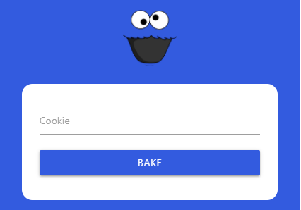
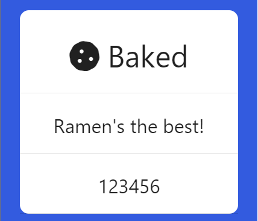
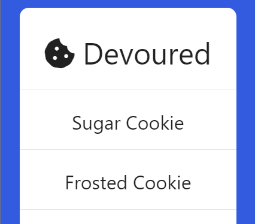

# Hungry Cookie Monster
## The Sequelize

### Purpose  
This is a full stack application for demonstrating simple MySQL database management. 

### How to use  
The home page contains three main areas.  
The bake a cookie form:  

>  

The baked cookie list:  

>  

The devoured cookie list:  

>  

Add a cookie to the MySQL database using the bake form.  
The baked cookie will immediately appear in the baked cookie list.  
Click on any cookie in the baked cookie list to devour it.  
Devoured cookies will disappear from the baked cookie list and reappear in the devoured cookie list.

### Deployment  
> https://enigmatic-ravine-58782.herokuapp.com/

### Technologies  
> Express-React-Views, HTML5, CSS3, JavaScript, Node.js, Express.js, MySQL, Sequelize, Heroku

Express-React-Views, HTML5, CSS3, and JavaScript were used to create and design the front-end of the application.  
Node.js and Express.js were used for the server.  
I chose to use Sequelize for managing my MySQL database.
I used Heroku to deploy my application.